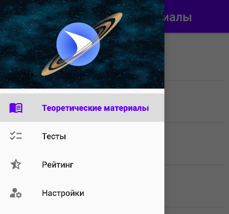

## Руководство пользователя

### 6.1. Введение

Приложение предназначено для изучения основных понятий и явлений в космосе с последующим прохождением тестирования по изученному материалу. Приложение отличается простотой и доступностью для понимания. Освоить его может любой человек, обладающий основными навыками использования смартфона и логическим мышлением.

---

### 6.2. Интерфейс приложения

### 6.2.1. Краткий обзор экранов приложения

Экран «Теоретические материалы» позволяет просматривать текстовую и графическую информацию по указанным темам;

Экран «Тесты» позволяет просматривать список тестов, доступных для прохождения;

Экран «Рейтинг» позволяет оценить, насколько хорошо пользователь справляется с прохождением тестов;

Экран «Настройки» позволяет устанавливать и изменять фамилию, имя и отчество пользователя, а также проверять наличие обновлений и устанавливать их при наличии.

Переход между экранами осуществляется через меню.

---

### 6.2.2. Экран «Теоретические материалы»

При запуске приложения открывается экран с теоретическим материалами, сгруппированными по категориям. Группировка выполнена в виде раскрывающегося списка, в каждом элементе которого отображается название группы и количество записей в ней. При раскрытии группы отображается превью, название и краткое описание статьи.

При нажатии на статью, пользователь может ознакомиться с её содержанием.

---

### 6.2.3. Экран «Тесты»

*Примечение: необходимо подключение к Интернету*

На экране выводится список тестов, в котором отображается тема теста, отметка о прохождении, результат и возможность перепрохождения.

Возможные состояния теста и их отображение представлены в таблице 1.

Таблица 1 – Возможные состояния теста

|Описание состояние|Отображение|
| :-: | :-: |
|Тест не был ни разу пройден|
|Тест был пройден успешно (набрано 6 баллов и более). В этом случае результат фиксируется и перепрохождение недоступно.|
|Тест не был успешно пройден (набрано менее 6 баллов). В этом случае пользователю будет предоставлена возможность заново пройти тест через 2 часа. При этом вопросы к тесту выбираются заново.|

При выборе теста будет загружено окно с вопросами.

После нажатия кнопки «Завершить тест» пользователь должен будет подтвердить своё действие или отменить его. Если пользователь подтвердил завершение, то ответы будут отправлены на проверку, после чего будет отображено, на какие вопросы был дан верный ответ, а на какие – неверный.

---

### 6.2.4. Экран «Рейтинг»

*Примечение: необходимо подключение к Интернету*

После прохождения любого теста, вне зависимости от результата, открывается возможность просмотра личного рейтинга. На экране будет выведена сумма очков по всем тестам и процент игроков, чей результат хуже. Также будет отображаться прогресс получения сертификата и кнопка для скачивания, если все тесты успешно пройдены.

---

### 6.2.5. Экран «Настройки»

*Примечение: необходимо подключение к Интернету*

Здесь пользователь может изменить свои фамилию, имя и отчество, а также проверить наличие обновлений для приложения. Возможность изменения ФИО блокируется после выпуска сертификата.

